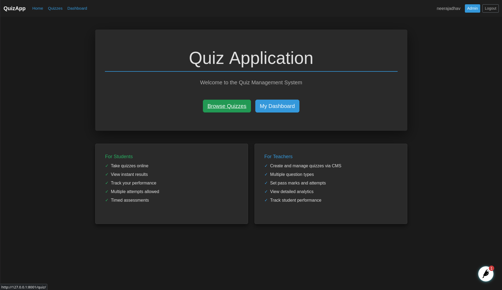
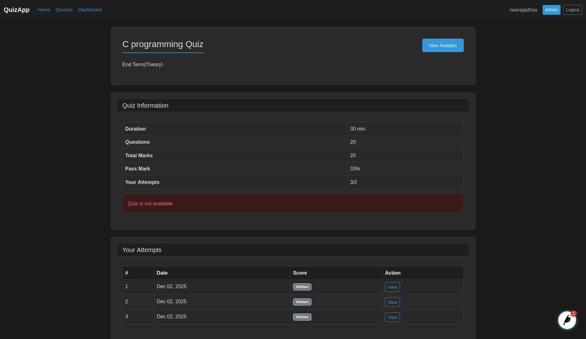
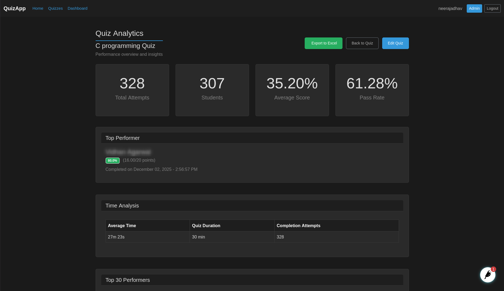
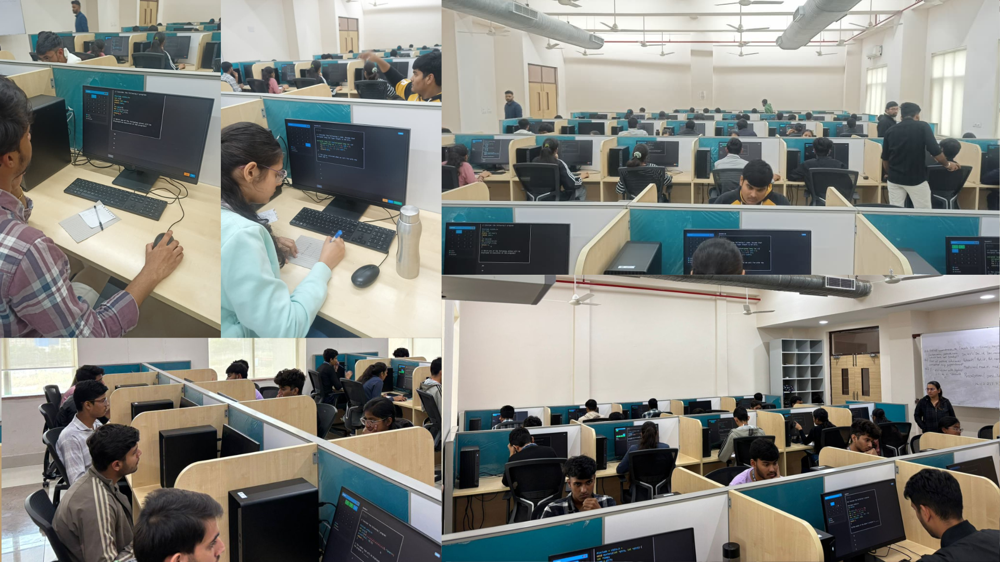

# QuizAppFull

**A robust, production-ready Quiz Application successfully deployed at IIIT Kota for BTech end term examinations.**

---

## Table of Contents
- [QuizAppFull](#quizappfull)
  - [Table of Contents](#table-of-contents)
  - [Project Overview](#project-overview)
  - [Screenshots](#screenshots)
    - [Application Homepage](#application-homepage)
    - [Quiz Taking Interface](#quiz-taking-interface)
    - [Analytics Dashboard](#analytics-dashboard)
  - [Real-World Deployment](#real-world-deployment)
    - [IIIT Kota BTech End Term Examinations](#iiit-kota-btech-end-term-examinations)
  - [Key Features](#key-features)
  - [Documentation](#documentation)
    - [Setup Guides](#setup-guides)
    - [Cloud Infrastructure](#cloud-infrastructure)
    - [Reference Guides](#reference-guides)
    - [Reports \& Analytics](#reports--analytics)
  - [Success Metrics](#success-metrics)
  - [Project Status](#project-status)
  - [License](#license)

---

## Project Overview

A robust, scalable Quiz Application built with Django, designed to handle high traffic loads. This application has been successfully deployed on Google Cloud Platform (GCP) and proven to handle **300 concurrent users** seamlessly.

Built with a focus on scalability, security, and user experience, this application serves as a complete solution for conducting online examinations and quizzes at institutional scale.

---

## Screenshots

### Application Homepage

*Clean, intuitive interface for students to access their quizzes*

### Quiz Taking Interface

*User-friendly quiz interface with clear question presentation*

### Analytics Dashboard

*Comprehensive analytics for instructors to track performance*

---

## Real-World Deployment

### IIIT Kota BTech End Term Examinations

This application was successfully deployed at **Indian Institute of Information Technology (IIIT) Kota** for conducting BTech end term examinations. The deployment was a complete success with:

- **Seamless examination experience** for students
- **Zero downtime** during peak usage
- **Reliable performance** across multiple concurrent sessions
- **Secure exam delivery** with proper authentication and authorization

*Students taking their BTech end term examinations using QuizAppFull at IIIT Kota*

This real-world deployment validated the application's production readiness and scalability under actual examination conditions.

---

## Key Features

- **Scalable Architecture**: Built to run on Kubernetes (GKE) with Cloud SQL
- **High Performance**: Optimized for concurrent usage (tested with 300+ users)
- **Secure**: Integrated with Google Secret Manager for secure credential management
- **User Friendly**: Intuitive interface for taking quizzes
- **Production Ready**: Successfully deployed in real institutional environment
- **Analytics & Monitoring**: Comprehensive logging and performance tracking
- **Cloud Native**: Fully leverages GCP services for reliability and scale

---

## Documentation

### Setup Guides
- [Prerequisites](docs/PREREQUISITES.md) - Local development requirements
- [Manual Setup Guide](docs/MANUAL_SETUP.md) - Step-by-step manual deployment
- [Cloud SQL Setup](docs/CLOUD_SQL_SETUP.md) - Database configuration
- [GCS Media Setup](docs/GCS_MEDIA_SETUP.md) - Cloud storage configuration
- [Kubernetes Deployment](docs/GKE_DEPLOYMENT_README.md) - GKE deployment guide

### Cloud Infrastructure
- [GCP Infrastructure Guide](docs/gcp.md) - Overall GCP architecture
- [GCP Cloud SQL Documentation](docs/GCP_CLOUD_SQL_README.md) - Detailed Cloud SQL setup
- [Kubernetes Guide](docs/k8s.md) - Kubernetes configuration details
- [Git Migration Guide](docs/git_migrate.md) - Version control migration

### Reference Guides
- [Cloud SQL Quick Reference](docs/CLOUD_SQL_QUICK_REFERENCE.md) - Common SQL operations
- [Backup & Download Guide](docs/CLOUD_SQL_BACKUP_DOWNLOAD.md) - Database backup procedures
- [Tasks & TODOs](docs/tasks.md) - Development tasks and improvements
- [Notes](docs/Notes.md) - Additional development notes

### Reports & Analytics
- [Project Status](docs/PROJECT_STATUS.md) - Current project status and completion
- [GCP Insights Report](GCP_INSIGHTS_REPORT.md) - GCP service usage and performance metrics
- [Cloud Logs Analytics](cloud_logs/logs_analytics.md) - Detailed log analysis and insights
- [Security Audit](SECURITY_AUDIT.md) - Security assessment and recommendations

---

## Success Metrics

- ✅ **300+ concurrent users** handled seamlessly
- ✅ **Zero downtime** during production deployment
- ✅ **Successfully deployed** at IIIT Kota for BTech examinations
- ✅ **Production-tested** under real examination conditions
- ✅ **Fully documented** with comprehensive guides and reports
- ✅ **Cloud-native architecture** leveraging GKE, Cloud SQL, GCS

---

## Project Status

✅ **COMPLETED & PRODUCTION-PROVEN**

This project has been successfully completed and validated in production at IIIT Kota. For detailed status information, see [docs/PROJECT_STATUS.md](docs/PROJECT_STATUS.md).

---

## License

See [LICENSE](LICENSE) file for details.

---

**Built with ❤️ for educational institutions**
